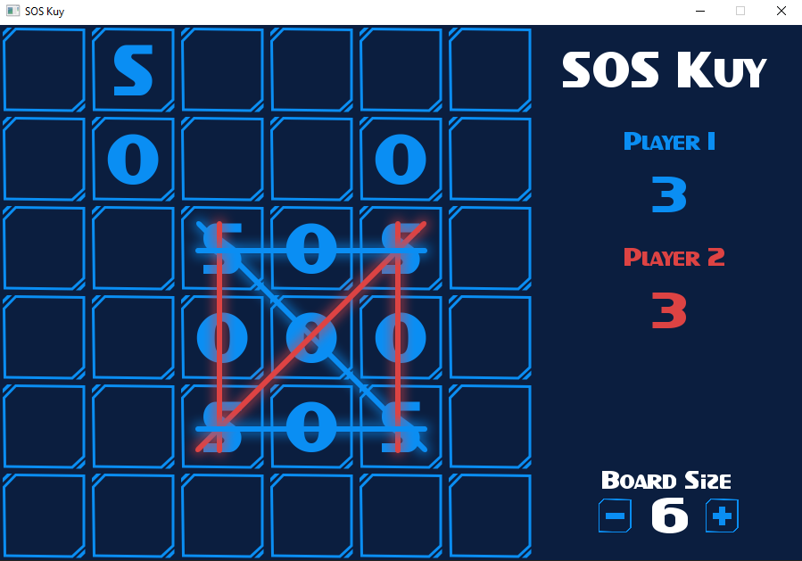

# SOS Kuy

## Proyek Akhir Pemrograman Gim TIF-A
### Nama  : Abdurrahman Faiz
### NIM   : 185150201111063

### Description
Sebuah permainan papan yang mengharuskan setiap pemain untuk menyusun 3 huruf yaitu SOS. Biasanya dimainkan bersama teman-teman di sekolah maupun tempat lainnya. Sekarang dapat dimainkan bersama teman di komputer.

### Gameplay
Sebuah papan dengan dimensi n x n dengan besaran n dapat ditentukan sendiri (3 - 9). Setiap pemain bergiliran untuk menuliskan huruf 'S' atau 'O' di kotak-kotak pada papan sebanyak 1 setiap giliran. Setiap huruf SOS yang berhasil dibentuk oleh pemain akan memberikan sebuah poin bagi pemain tersebut, dan mendapatkan giliran tambahan. Permainan akan berakhir ketika seluruh kotak telah terisi penuh. Dan pemenang dalam permainan tersebut adalah pemain yang memiliki skor tertinggi.

#### Screenshot

